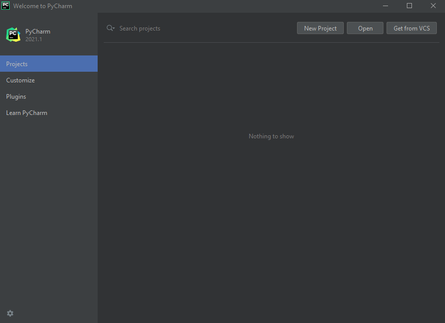
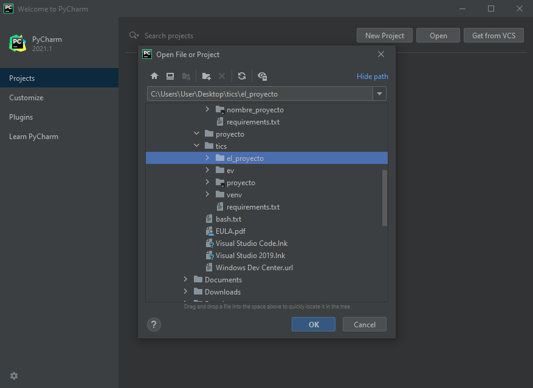
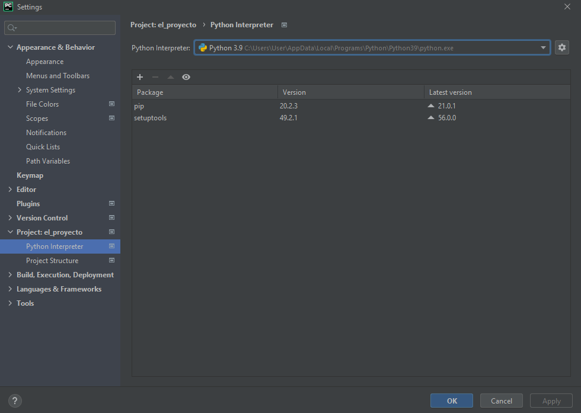
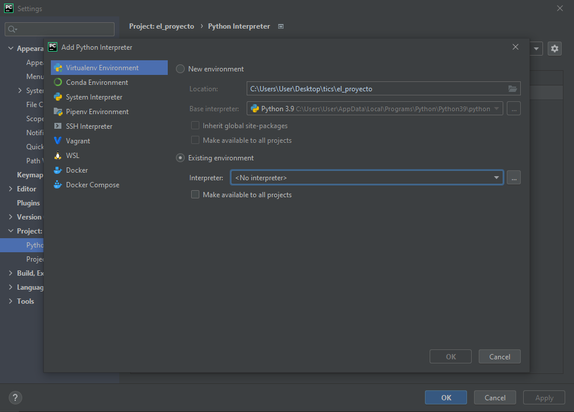
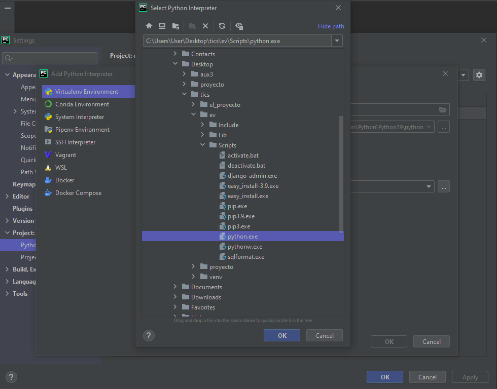
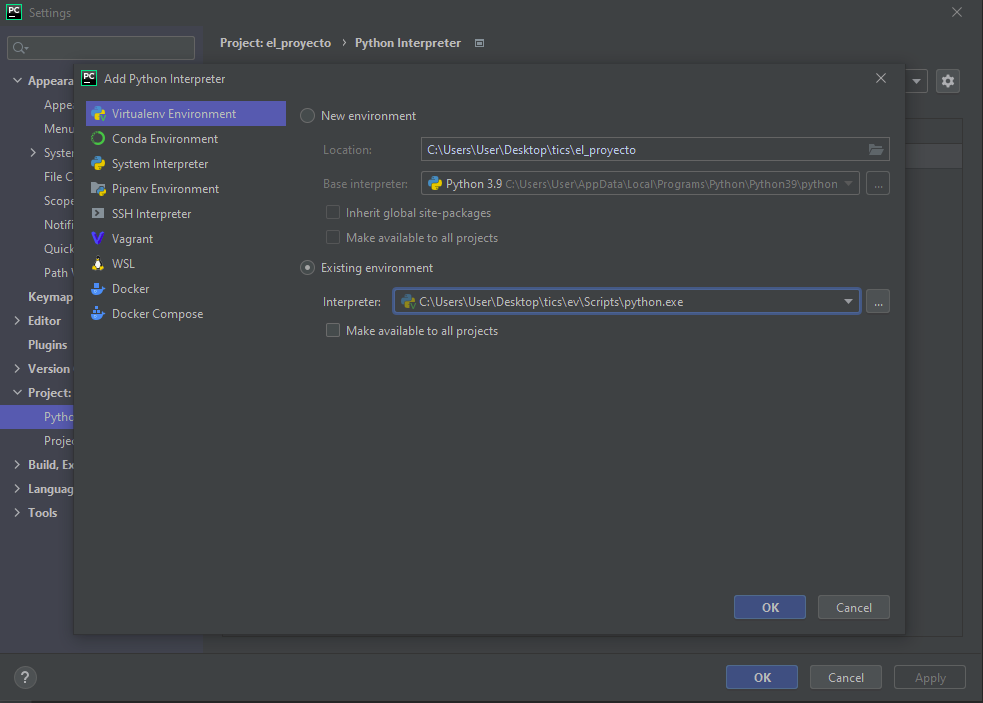

# Primera parte: Iniciar nuevo proyecto de django

## Seteando el ambiente virtual
```
python -m venv ev
ev\Scripts\activate
```
Nota: En caso de MacOS para activar el ambiente virtual el comando es `source ev/bin/activate`

## Instalando Django
```
pip install django
pip freeze > requierements.txt
```

## Creando el proyecto
```
django-admin startproject nombre_proyecto
```
Nota: Reemplazar `nombre_proyecto` por el nombre deseado

## Creando una aplicación
```
cd nombre_proyecto
python manage.py startapp nombre_app
```
Nota: Reemplazar `nombre_app` por el nombre deseado

### Instalando la aplicación
Es necesario decirle a django que hemos creado una nueva aplicación. En el archivo `nombre_proyecto\settings.py` modificamos la lista de aplicaciones instaladas, agregándole `nombre_app`:
```
INSTALLED_APPS = [
    'django.contrib.admin',
    'django.contrib.auth',
    'django.contrib.contenttypes',
    'django.contrib.sessions',
    'django.contrib.messages',
    'django.contrib.staticfiles',
    'nombre_app',
]
```

### Configurando la URL de la aplicación
Para asignarle una ruta a la aplición debemos crear un archivo `urls.py` en la carpeta de la aplicación (`nombre_app\urls.py`).
Luego debemos editar el archivo `nombre_proyecto\urls.py`, importando además el modulo `include`, quedando de la siguiente forma:
```
from django.contrib import admin
from django.urls import path, include

urlpatterns = [
    path('admin/', admin.site.urls),
    path('', include('nombre_app.urls')),
]
```

## Añadiendo templates
Para poder crear los *templates* de una aplicación, en la carpeta de la aplicación (`nombre_app`) debemos crear una carpeta llamada `templates` y dentro de esta misma otra carpeta con el nombre de la aplicación (`nombre_app`). Dentro de esta carpeta irán los *templates* HTML que vayamos creando.

Revisar el siguiente [HTML](nombre_proyecto/nombre_app/templates/nombre_app/index.html) como referencia.

Ahora, solo nos queda renderizar el *template* en una ruta. Para esto, debemos crear una función en el archivo `nombre_proyecto\views.py` que se encargue de renderizar el HTML:
```
from django.shortcuts import render

# Create your views here.
def index(request):
    return render(request, 'nombre_app/index.html')
```
Finalmente para añadir esta función a una ruta, debemos editar el archivo `nombre_app\urls.py` (Creado en la sección [Configurando la URL de la aplicación](#configurando-la-url-de-la-aplicación)):
```
from django.urls import path
from . import views

urlpatterns = [
    path('', views.index, name="index"),
]
```


## Corriendo el proyecto
```
python manage.py runserver
```

# Segunda parte: Integrando un proyecto a PyCharm
## Abriendo el proyecto en Pycharm
En la ventana principal de PyCharm, le damos a *Open* y buscamos la carpeta del proyecto de django.

OJO: Debemos importar la carpeta del proyecto, la que en su interior contiene el archivo `manage.py`




## Importando el ambiente virtual en PyCharm
Para que el proyecto pueda correr con el ambiente virtual que ya creamos, necesitamos decirle a PyCharm en dónde está ubicado.

Para esto, en la barra de herramientas debemos ir a la pestaña `File`->`Settings`.

En esta nueva ventana, vamos a la sección *Project: nombre_proyecto*. En esta sección, pinchamos en la ruedita:



En esta nueva ventana, marcamos *Existing enviroment* y debemos importar el archivo `python.exe` que se encuentra en `ev\Scripts\python.exe` (`ev\` corresponde a la carpeta del ambiente virtual que ya habíamos creado).





Quedando de la siguiente forma:




